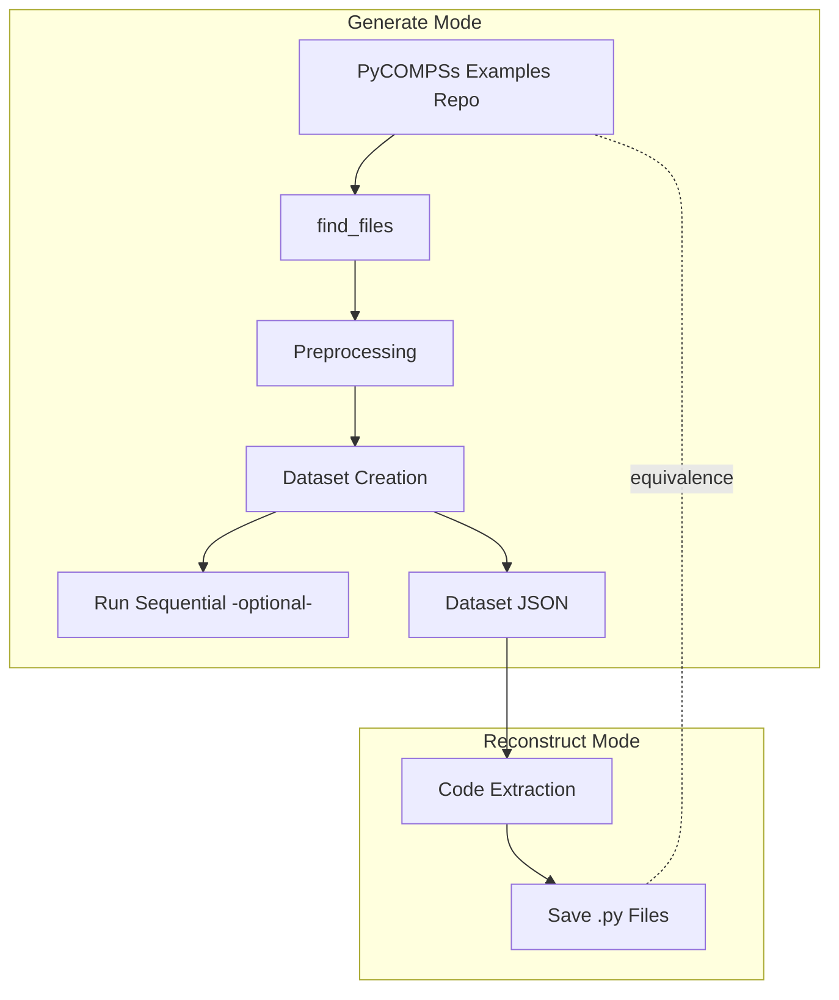

# PyCOMPSs Dataset Scraper

This project provides tools to **generate** and **reconstruct** datasets of PyCOMPSs  code examples.\
It supports the fine-tuning of Large Language Models (LLMs) for **PyCOMPSs code generation**.

All Python files in this project include **docstrings** for clarity and maintainability.

## 📑 Table of Contents

- [📂 Project Structure](#-project-structure)
- [🛠 Installation](#-installation)
- [📑 PyCOMPSs Repository Requirements](#-pycompss-examples-repository-requirements)
- [🚀 Usage](#-usage)
  - [1️⃣ Generate Mode](#1️⃣-generate-mode)
  - [2️⃣ Reconstruct Mode](#2️⃣-reconstruct-mode)
- [🔄 Workflow Diagram](#-workflow-diagram)
- [🧪 Testing](#-testing)
- [📌 Dataset Format](#-dataset-format)
- [📋 Templates](#-templates-file)


---

## 📂 Project Structure

```
.
├── main.py                # Entry point with CLI
├── dataset.py             # Dataset manager (load/save JSON)
├── preprocessor.py        # Extracts & formats code/description
├── reconstruct.py         # Reconstructs source code from dataset
├── runner.py              # Runs sequentialized code for validation
├── utils.py               # Helpers (file scanning, regex, etc.)
├── templates.json         # Dataset prompt templates
├── requirements.txt       # Python dependencies
├── testing/               # Unit tests and black box tests
│   ├── dataset_test.py
│   ├── preprocessor_test.py
│   ├── reconstruct_test.py
│   ├── utils_test.py
│   └── test_files/        # Fixtures for tests
└── logging.log            # Log output (auto-generated)
```

---

## 🛠 Installation

This project was developed with **Python 3.12.11**.\
It is recommended to use a **virtual environment**.

```bash
# Create and activate venv
python3.12 -m venv env
source env/bin/activate

# Install dependencies
pip install -r requirements.txt
```

---

## 📑 PyCOMPSs Examples Repository Requirements

The input **PyCOMPSs Examples Repository** must follow this structure for each application:

```
app_name/
├── README          # Application description
└── src/            # Python source code files
    ├── file1.py
    ├── file2.py
    └── ...
```

---

## 🚀 Usage

The entry point is `main.py`, which exposes two modes: `generate` and `reconstruct`. The usage of the application can be displayed with `python main.py --help`

<details>
<summary>Click to expand</summary>

```
usage: A scraping application to generate and reconstruct the datasets of PyCOMPSs examples. [-h] {generate,reconstruct} ...

positional arguments:
  {generate,reconstruct}
    generate            Generate the dataset from the PyCOMPSs examples repository
    reconstruct         Reconstruct the Python source code from the dataset

options:
  -h, --help            show this help message and exit
```
</details>

---

### 1️⃣ Generate Mode

The Generate Mode scans the **PyCOMPSs Examples repository** and builds datasets. The usage of Generate Mode can be displayed with `python main.py generate --help`

<details>
<summary>Click to expand</summary>

```
usage: A scraping application to generate and reconstruct the datasets of PyCOMPSs examples. generate [-h] --repo REPO [--ignore [IGNORE ...]] [--auto-split] [--run-sequential exec_command args_file]

options:
  -h, --help            show this help message and exit
  --repo REPO           Path to the PyCOMPSs examples repository
  --ignore [IGNORE ...]
                        List of directories to ignore
  --auto-split          Automatically split the dataset into train and test sets
  --run-sequential exec_command args_file
                        Run the each sequential code using the provided command and arguments file. Example: --run-sequential "env/bin/python -c" arguments.json. More info in the README.
```

</details>

As an example, the command and arguments used to generate the datasets of the PyCOMPSs examples are:

```bash
python main.py generate \
--repo \
$HOME/BSC/code/apps/python/examples \
--ignore \
$HOME/BSC/code/apps/python/examples/sort/generator \
$HOME/BSC/code/apps/python/examples/sort_by_key/generator \
$HOME/BSC/code/apps/python/examples/neurons \
$HOME/BSC/code/apps/python/examples/modelfactors \
$HOME/BSC/code/apps/python/examples/bioinf_seq_analysis \
$HOME/BSC/code/apps/python/examples/mpi \
$HOME/BSC/code/apps/python/examples/gromacs \
--run-sequential \
"$HOME/BSC/code/chatpycompss/scripts/env/bin/python -c" \
$HOME/BSC/code/apps/python/examples/arguments.json
```

After the execution, a directory will be created inside `.script_output` to store the dataset files and the execution results (if `--run-sequential` argument was specified). An example of results after executing the previous command is:

```
chatpycompss/.script_output/proud_zebra_20250821-111435
├── dataset
│   ├── descr_to_par.json
│   └── seq_to_par.json
└── execution_results
    └── execution_results.json
```

⚠️ By using the argument `--run-sequential exec_command args_file` the sequential code string will be run in background for checking the correctness of the seuquentialization algorithm. Take into consideration that:

- The `exec_command` must be a python interpreter that has installed all the packages needed for executing the sequential code.
- The `exec_command` must specify the `-c` argument because it needs to run a string and not a file.
- The `args_file` must be a `json` file with a mapping from application name to a list of arguments. Note that the application name is derived from the directory structure by concatenating directory names with a hyphen. See `runner.py` and `utis.find_files` docstring for more details.

#### Workflow

1. Repository is scanned using `utils.find_files`.
2. **Preprocessor** extracts:
   - Parallel code (cleaned, comments removed, unified into a single file).
   - Sequential code (automatically derived).
   - Description (scraped from the app’s README).
3. The **Dataset class** (`dataset.py`) assembles this into JSON entries.
4. Two datasets are produced:
   - **Sequential -> Parallel**: The prompt is the sequential code, and the answer is the PyCOMPSs code.
   - **Description -> Parallel**: The prompt is the application description, and the answer is the PyCOMPSs code.
5. Optional: Sequential codes are executed for checking correctness.

---

### 2️⃣ Reconstruct Mode

Rebuilds Python source code from an existing dataset file. The usage of Reconstruct Mode can be displayed with `python main.py reconstruct --help`

<details>
<summary>Click to expand</summary>

```
usage: A scraping application to generate and reconstruct the datasets of PyCOMPSs examples. reconstruct [-h] --dataset-file DATASET_FILE --dataset-type {seq_to_par,descr_to_par}

options:
  -h, --help            show this help message and exit
  --dataset-file DATASET_FILE
                        Path to the dataset json file
  --dataset-type {seq_to_par,descr_to_par}
                        Type of dataset to reconstruct
```
</details>

As an example, the command and arguments used to reconstruct the codes from a dataset stored in `chatpycompss/.script_output/proud_zebra_20250821-111435/dataset/seq_to_par.json` are:

```bash
python main.py reconstruct \
--dataset-file \
../.script_output/proud_zebra_20250821-111435/dataset/seq_to_par.json \
--dataset-type \
seq_to_par
```

After the execution, a directory will be created inside `.script_output` to store the Python source codes. An example of results by executing the previous command is:

```
chatpycompss/.script_output/silly_koala_20250821-112413/
└── dataset_codes
    ├── _seq_to_par_code0.py
    ├── _seq_to_par_code1.py
    ...
    └── _seq_to_par_code20.py
```

#### Workflow

1. Uses regex to extract code blocks from dataset entries.
2. Writes them back to `.py` files.

This is essentially the **inverse process** of Generate Mode.

---

## 🔄 Workflow Diagram



---

## 🧪 Testing

Run tests with `pytest`. Tests cover dataset generation, preprocessing, reconstruction, and utilities.

---

## 📌 Dataset Format

All datasets follow the structure:

```
[
  {
    "question": "...",
    "context": "...",
    "answer": "..."
  },
  ...
]
```

Two dataset types are supported:

- `seq_to_par`: Sequential code -> PyCOMPSs code
- `descr_to_par`: Application description -> PyCOMPSs code

---

## 📋 Templates file

At the `scripts` directory, there is a file named `templates.json` which contains the templates that will be used for both generating the dataset and reconstructing the codes.

```json
{
    "question_descr_to_par": "Knowing that the description of the application is:\n%s\nCan you provide the parallelized version of the code using PyCOMPSs?",
    "context_descr_to_par": "Parallelize Python code using pyCOMPSs",
    "answer_descr_to_par": "%s",
    "question_seq_to_par": "Can you parallelize this Python code using pyCOMPSs? The code is:\n%s",
    "context_seq_to_par": "Parallelize Python code using pyCOMPSs",
    "answer_seq_to_par": "%s"
}
```
In each `%s` the respective code/description is inserted. For example, given this dummy PyCOMPSs code:

```python
@task(returns=int)
def add(a, b):
    return a + b
```

The resulting dataset `seq_to_par` entry will look like:

```json
{
  "question": "Can you parallelize this Python code using pyCOMPSs? The code is:\ndef add(a, b):\n    return a + b",
  "context": "Parallelize Python code using pyCOMPSs",
  "answer": "@task\ndef add(a, b):\n    return a + b"
}
```

Feel free to modify it for your own usecase!